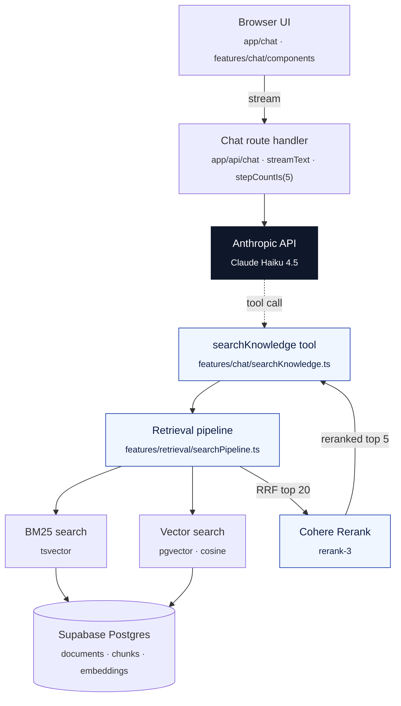

# Production RAG — Orbiill Docs

> Retrieval-augmented chatbot with hybrid search, reranking, and an eval harness.

🔗 **[Live demo](https://portfolioproduction-rag-kb-staging.up.railway.app/)** · 📂 **[Portfolio](https://julianlopez.dev)** · 💻 **[Source on GitHub](https://github.com/stivenslop2/production-rag-kb)**

---

## The problem it solves

Developer-facing documentation is hard to navigate at the moment a user actually has a question. Vector search alone misses exact identifiers (error codes, status names, SDK method names); keyword search alone misses paraphrased questions. This project answers questions about Orbiill — a fictional billing platform — by combining BM25 and vector retrieval, reranking the top candidates, and only then handing cited chunks to a tool-calling agent. Every retrieval strategy is measured against a 74-query golden dataset, so improvements are quantified rather than vibed.

---

## AI techniques demonstrated

| Technique | Implementation | Where to look |
|-----------|----------------|---------------|
| Hybrid retrieval | Parallel BM25 (Postgres tsvector) + vector search (pgvector, cosine) fused with Reciprocal Rank Fusion (k = 60) | `features/retrieval/hybridSearch.ts` |
| Reranking | Top-20 hybrid candidates rescored by the Cohere Rerank API before final selection | `features/retrieval/rerank.ts`, `features/retrieval/searchPipeline.ts` |
| Tool-calling RAG agent | Claude Haiku 4.5 invokes `searchKnowledge` on demand, reformulates queries, and classifies result confidence (high/medium/low). Loop capped by `stepCountIs(5)` | `app/api/chat/route.ts`, `features/chat/searchKnowledge.ts` |
| Strategic chunking | Recursive heading-aware splitting (~1000 char target, 200 char overlap) with frontmatter parsing | `features/ingestion/chunker.ts` |
| Eval automation | 74-query golden set with literal and conversational query variants; precision@5, MRR, NDCG, plus difficulty-stratified hit rates per strategy | `features/eval/runner.ts`, `features/eval/metrics.ts`, `scripts/eval.ts` |

---

## Stack

- **Framework:** Next.js 16 (App Router, Turbopack, Route Handlers)
- **Runtime:** React 19, TypeScript 5
- **AI — streaming & tools:** Vercel AI SDK v6 (`ai`, `@ai-sdk/anthropic`, `@ai-sdk/react`)
- **Embeddings:** OpenAI `text-embedding-3-small` (1536 dims)
- **Reranking:** Cohere Rerank API
- **Model:** Claude Haiku 4.5
- **Database:** Supabase Postgres + `pgvector` (vector) + `tsvector` (BM25)
- **Styling:** Tailwind CSS 4

---

## Architecture



- **The agent owns retrieval, not the route handler.** `app/api/chat/route.ts` exposes one tool (`searchKnowledge`); the model decides when and how to call it. This keeps query reformulation under the LLM's control instead of pre-baking it server-side.
- **Hybrid before rerank, not after.** RRF fuses BM25 and vector ranks with no score scaling, then a single Cohere call rescores the top 20. Mixing similarity scores across retrievers directly would be apples-to-oranges.
- **Eval is a first-class feature.** `features/eval/` is a library (`metrics.ts`, `runner.ts`), not a script. `scripts/eval.ts` is the thin CLI on top — so the same runner can power a future `/eval` dashboard route.
- **Types live in `shared/types/` when cross-feature.** `SearchResult`, `HybridSearchResult`, `RerankedResult`, `DocumentMetadata` are shared; ingestion-internal shapes stay in `features/ingestion/types.ts`.

---

## Notable engineering decisions

### Hybrid + rerank over a single retriever

A pure vector search misses literal identifiers like `429`, `webhook_signature_invalid`, or SDK method names. Pure BM25 misses paraphrased questions ("why am I being blocked?" vs. "rate limit"). RRF fuses both rankings without score normalisation; Cohere then rescores semantically. Measured against the golden set, `hybrid+rerank` consistently leads on precision@5 and NDCG@5.

### Reformulation owned by the LLM, not the server

The system prompt instructs the model to extract concepts and search for those — not to forward the user's question verbatim. This is cheaper and simpler than implementing query rewriting server-side, and the model can iterate (search → low confidence → reformulate → search again) within the same step budget.

### Eval as a library, not a script

The metrics functions (`precisionAtK`, `meanReciprocalRank`, `ndcg`) and the runner are exported from `features/eval/`. `scripts/eval.ts` is a thin CLI. This means a future in-app eval explorer can call the same code without shelling out.

### Confidence classification on the tool response

`searchKnowledge` returns `confidence: "high" | "medium" | "low"` based on the top rerank score. The system prompt tells the model to either answer confidently, hedge, or reformulate and try again. Without this, low-quality retrievals get presented as if they were ground truth.

---

## Run locally

```bash
git clone https://github.com/stivenslop2/production-rag-kb
cd production-rag-kb
npm install
cp env.example .env.local  # fill in API keys
npm run ingest             # one-time: chunk + embed docs into Supabase
npm run dev
```

Open <http://localhost:3000>.

Required environment variables (see `env.example`):

- `OPENAI_API_KEY` — embeddings
- `SUPABASE_URL`, `SUPABASE_ANON_KEY` — Postgres + pgvector
- `COHERE_API_KEY` — reranking
- `ANTHROPIC_API_KEY` — chat model

### Useful scripts

```bash
npm run dev               # Next.js dev server
npm run ingest            # Re-ingest data/docs/*.md
npm run eval              # Run the 74-query golden eval across 4 strategies
npm run generate:golden   # Regenerate the golden dataset
npm run verify:hybrid     # Manual smoke check for hybrid search
npm run verify:rerank     # Manual smoke check for the rerank step
npm run verify:pipeline   # End-to-end retrieval pipeline check
```

---

## What's next

- [ ] `/search` explorer page that shows per-strategy retrieval traces (BM25 hits, vector hits, RRF score, rerank score) for a given query
- [ ] In-app eval dashboard powered by `features/eval/`
- [ ] Multi-corpus support — currently scoped to the Orbiill docs only
- [ ] Streaming the retrieval status into the chat ("searching…", "reranking…") instead of just the tool indicator

---

## About

Built by **Julian Lopez** — AI Engineer · Full Stack.
[Portfolio](https://julianlopez.dev) · [LinkedIn](https://www.linkedin.com/in/jstivenslopez/) · [GitHub](https://github.com/stivenslop2)

License: MIT
